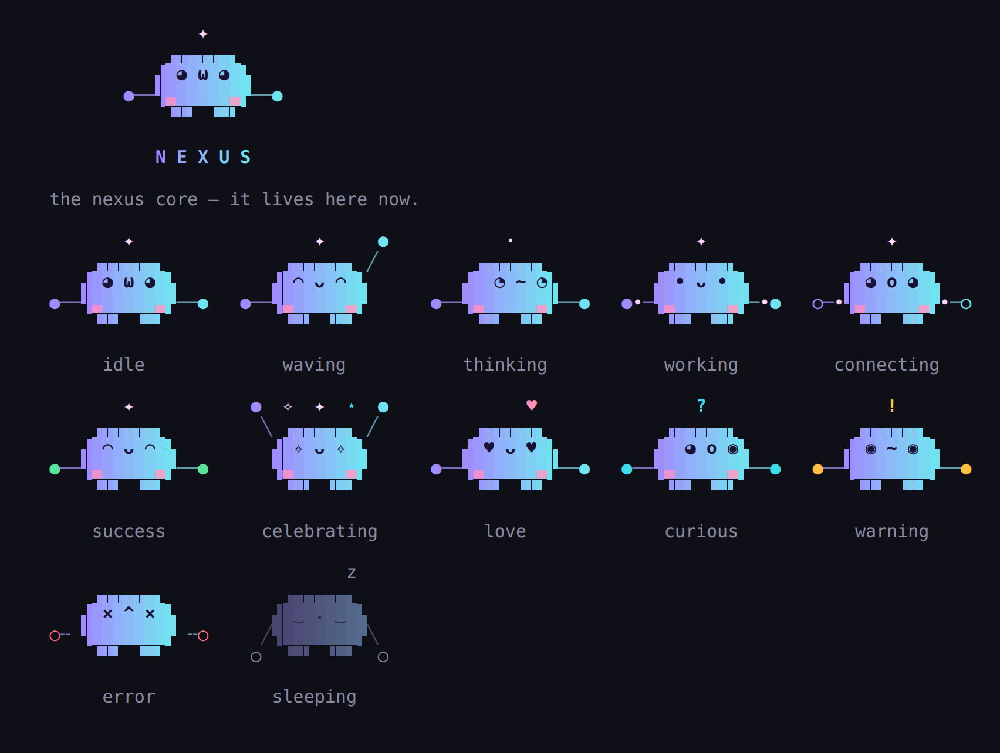

# Meet Nex

<p align="center"></p>

Nex is the little creature that lives in your terminal and looks after your
database. Nex is round, pastel, mostly calm, occasionally delighted, and
very fond of well-indexed tables.

```
       ✦
    ▗▄▄▄▄▄▖
   ▟ ◕ ω ◕ ▙
●──▜▃     ▃▛──●
    ▝▀▘ ▝▀▘
```

## What Nex is

Nex *is* a nexus: the thing in the middle that everything connects to. The
two dots Nex holds are network nodes — your database on one side, your app
on the other. The spark on top is its antenna; it twinkles when Nex is
thinking.

## Say hello

```bash
nexus hi          # a greeting for the time of day, how your project is doing, a tip
nexus pet         # a pat. Nex keeps count.
nexus mascot      # every mood at once
nexus mascot love # one mood (try --loop)
```

Nex remembers how many pats you've given (in your user config folder) and
has something special to say at some milestones. It doesn't do anything
else. Sometimes that's the point.

## Moods

| mood | looks like | when |
|---|---|---|
| idle | `◕ω◕`, blinks and glances around | all is well |
| waving | `◠ᴗ◠`, one arm up | saying hello |
| thinking | `◔~◔`, antenna twinkling | working something out |
| working | `•ᴗ•`, data flowing in | running something |
| connecting | `◕o◕`, nodes lighting up | starting the database |
| success | `◠ᴗ◠` | it worked |
| celebrating | `✧ᴗ✧`, arms up, sparkles | big moments |
| love | `♥ᴗ♥`, floating hearts | after a pat |
| curious | `◕o◉`, `?` antenna | noticed something worth a look |
| warning | `◉~◉`, `!` antenna | needs attention |
| error | `×^×`, arms disconnected | something broke |
| sleeping | `‿.‿`, dimmed, `z`s | the database is off |

## Where Nex shows up

Not everywhere — personality should help, not get in the way.

- **Big moments:** `nexus init` (Nex wakes up), the welcome screen, `hi`, `pet`.
- **Status faces:** the dashboard, the SQL shell, status panels and doctor
  show Nex's face reflecting the real state of things — asleep when the
  database is down, curious when there are pending migrations.
- **Everywhere else:** a single glyph (`✦`), and short, friendly sentences.

## How Nex talks

Lowercase, short, warm, never sarcastic, never in the way. Nex will say
"oops. something broke." — and then always tell you exactly what broke and
what to do next. Errors are never just jokes.

## Turning Nex off

```bash
nexus --plain …            # no mascot, no colour, ASCII only
export NEXUS_PLAIN=1       # always
nexus --no-animation …     # Nex stays, but holds still
```

`--json` output never includes Nex either.

## How Nex is drawn

Nex is 15 × 5 terminal cells. In colour, the body is made of
background-coloured cells and quadrant blocks (`▗▄▖ ▟▙ ▜▛ ▝▀▘`), so it
reads as one soft shape with a lavender-to-aqua gradient, dark eyes and pink
cheeks. Without colour Nex becomes line art with the same shape:

```
       ✦
   ╭───────╮
   │ ◕ ω ◕ │
●──┤·     ·├──●
   ╰┬─╯ ╰─┬╯
```

The code lives in `internal/ui/mascot`. Tests make sure every frame of every
mood is exactly the same size, so animations never jitter, and that no two
moods look alike.
